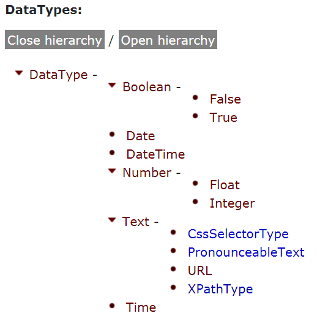
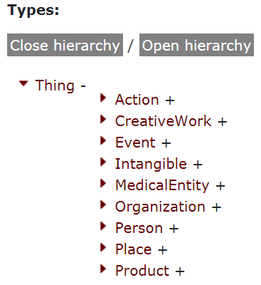
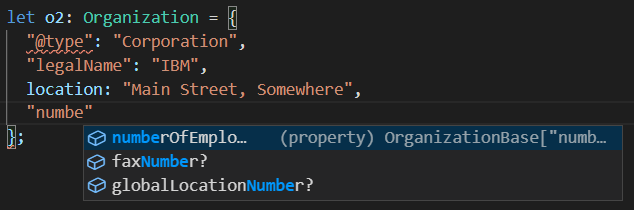

# Schema.org

[BACK](schema-json-ld.md) - [NEXT](storage-indexeddb.md) - [INTRO](readme.md)

There is a common set of constructs that are very frequently needed when describing any body of knowledge, such as Person, Organization, CreativeWork (book, film), Place or Product, and rather that each developer team create their own in-compatible representation, it makes a whole lot of sense to come up with a shared representation that everyone uses. schema.org is that shared representation. Schema.org is supported by Google, Microsoft, Pinterest and more. [Even Apple recommends it: ](https://developer.apple.com/library/archive/documentation/General/Conceptual/AppSearch/WebContent.html)
  "use standards-based markup for structured data, such as that defined at Schema.org. "

We see its use anywhere that has a large collection of data items about common topics. This includes search engines, encyclopedias, knowledge graphs, product catalogs, and similar, along with general enterprise databases. there is nothing to be gained when wishing to e.g. describe the same Organization to use in-compatible representations. Indeed, there is very much to gain by having the same representation - it facilitates the merger of two completely separate knowledge graphs created by isolated teams with no direct interaction, and provided they both use the same representation (e.g. schema.org) for a common construct - e.g. Organization - then these knowledge graphs will easily merge. Provided the same IRI is used by both to identify the same Organization instance then statements from differing sources about the same instance when merged will refer to the same instance.  

The schema.org types can be represented in a number of ways, including JSON-LD (which is the format Google recommends and Clipcode recommends it also). If you are planning to offer your app to work offline (e.g. a sometimes connected PWA app) then it is vital that your data format can also work offline (without connection to SQL databases or file stores in the cloud). JSON-LD also helps here, as the JSON-LD document can be edited offline and stored on the mobile device in IndexedDB; later when the device connects to the Internet, the locally stored document (possibly edited while offline) can be synced with the cloud.

## Schema.org For Data Scientists
Schema.org manages three hierarchies. It has a hierarchy of datatypes, with a root object of:
* schema:DataType (note capital 'T')

It has a hierarchy of enumerations, with the root object of:
* schema:Enumeration

It has a hierarchy of types, with the root object of:
* schema:Thing

When working with schema.org, you will be interacting with these three hierarchies as needed. The bulk of schema.org constructs are types (schema:Thing) with much smaller numbers of datatypes and enumerations. 

### Datatypes
schema:DataType is defined as:
````
    {
      "@id": "schema:DataType",
      "@type": "rdfs:Class",
      "rdfs:comment": "The basic data types such as Integers, Strings, etc.",
      "rdfs:label": "DataType",
      "rdfs:subClassOf": {
        "@id": "rdfs:Class"
      }
    },
````
Note schema.org does not use XSD types - which is a somewhat complicated datatype selection often used in the past. Instead, schema.org defines a much simpler and more practical set of datatypes. The [datatype hierarchy is listed here](https://schema.org/docs/full.html) as:



For datetime, it includes three datatypes, Date, Time and DateTime. Note these are schema.org types separate from any particular programming language that you might be using. The Date representation used is the ISO 8601 date format. Numbers are either integer or float. It you need finer grain control over numeric representation, you will need to add additional properties (e.g. if you an integer that must be positive, or if you need a float with a maximum number of subunits - such as when representing a currency).

### Enumerations
In schema.org, enumerations derive from sche.:Enumeration, which actually drives from schema:Intangible (which derives from schema:thing) but we like to sonsider the Enumeration hierarchy separate from teh more general schema:Thing types. 

schema:Enumeration is defined as:

````
    {
      "@id": "schema:Enumeration",
      "@type": "rdfs:Class",
      "rdfs:comment": "Lists or enumerations—for example, a list of cuisines or music genres, etc.",
      "rdfs:label": "Enumeration",
      "rdfs:subClassOf": {
        "@id": "schema:Intangible"
      }
    },
````
There are many enumeration types derived from schema:Enumeration and these 
[are listed at the bottom of this page](https://schema.org/Enumeration). 

### Types
All types in schema.org derive from schema:Thing. It is a relatively simple hierarchy, with just a few entries directly beneath the root:



It is best to think of these types as mostly a "horizontal" groupings of types needed in very many different scenarios, with one "vertical" arrangement, namely MedicalEntity. Intangibles [are defined as](https://schema.org/Intangible): 
"A utility class that serves as the umbrella for a number of 'intangible' things such as quantities, structured values, etc". 

## Programming Schema.org using TypeScript
The [Schema-DTS project](https://www.npmjs.com/package/schema-dts) provides TypeScript type definitions for schema.org. 
Its [source tree is here](https://github.com/google/schema-dts). 

The two key goals of Schema-DTS are easy code completion in an IDE that support this (e.g. Visual Studio Code); and strict validation by the TypeScript type checker.

To install, enter: 
````
npm install schema-dts
````
To use, import the schema.org type you need:
````
import { Organization, WithContext } from 'schema-dts';
````
and they create an instance of it:
````
let o2: Organization = {
      "@type": "Corporation",
      "legalName": "IBM",
      location: "Main Street, Somewhere",
      "numberOfEmployees": { 
        "@type": "QuantitativeValue",
        "value": 100000
      } 
    };
    console.log(JSON.stringify(o2));
    /* result: 
      { 
        "@type":"Corporation",
        "legalName":"IBM",
        "location":"Main Street, Somewhere",
        "numberOfEmployees": { "@type":"QuantitativeValue","value":100000 }
      }
    */
````
You may enter property names with or without quotes, but note in Visual Studio Code, it is better to use quotes as you see code completion suggestions. For example, when creating a corporation object and we wish at add the number of employees, but are unsure of the exact spelling of the property name, we can type the first few letters such as `"numbe` and Visual Studio Code will very helpfully list the matching properties:



### Context 
You will often wish to add a context, and this is supported using: 
````
const c: WithContext<Organization> = {
  "@context": 'https://schema.org',
  "@type": "PostOffice",
  "name": "Frienly Main Street Post Office",
  "aggregateRating": {
    "@type": "AggregateRating",
    "bestRating": 5
  }
}
````
Calling `JSON.stringify()` on this produces the following result:
````
    console.log(JSON.stringify(c));
    /* result:
      {
        "@context":"https://schema.org",
        "@type":"PostOffice",
        "name":"Friendly Main Street Post Office",
        "aggregateRating":{"@type":"AggregateRating","bestRating":5}
      } */
````

The Google developer behind Schema-DTS has written a number of very interesting blog posts about it:
[https://blog.eyas.sh/tag/schema-org/](https://blog.eyas.sh/tag/schema-org/)

[BACK](schema-json-ld.md) - [NEXT](storage-indexeddb.md) - [INTRO](readme.md)
