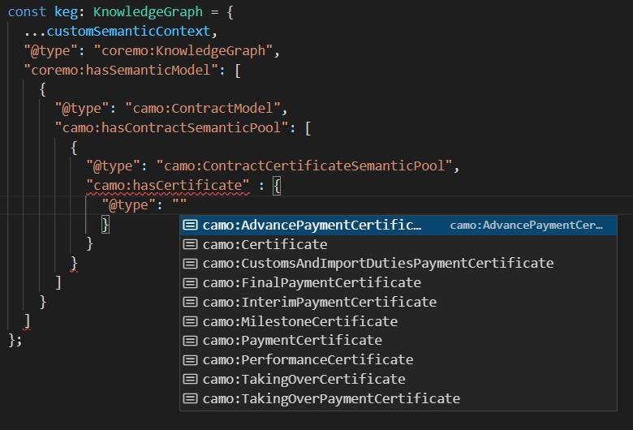

# clipcode-ts-schema
Clipcode TS Schema provides a TypeScript API to read and write semantic models. 

It is based on the open source [Schema-DTS](https://github.com/google/schema-dts) project. 

## Creating an Advance Payment Certificate
As an example, here we create an Advance Payment Certificate for a FIDIC contract:

````
import { KnowledgeGraph } from "./clipcode-schema";

export function createAdvancePaymentCert(): string {
    const keg: KnowledgeGraph = {
      ...customSemanticContext,
      "@type": "coremo:KnowledgeGraph",
      "coremo:hasSemanticModel": [
        {
          "@type": "camo:ContractModel",
          "camo:hasContractSemanticPool": [            
            {
              "@type": "camo:PaymentCertificateContractSemanticPool",
              "camo:hasPaymentCertificate" : {
                "@type": "camo:AdvancePaymentCertificate",
                "camo:contractPaymentDescriptionToUse": {
                  "@type": "camo:ContractPaymentDescription"               
                }
              }
            }
          ]
        }        
      ]
    };
      
    return JSON.stringify(keg, null, 2);
  }
````
It produces this output: 
````
{ 
  "@context": { .., 
  "@base": "https://clipcode.org/demo" 
}, 
  "@type": "coremo:KnowledgeGraph", 
  "coremo:hasSemanticModel": [ 
  { "@type": "camo:ContractModel", 
    "camo:hasContractSemanticPool": [ 
	  { "@type": "camo:PaymentCertificateContractSemanticPool", 
	    "camo:hasPaymentCertificate": 
		  { "@type": "camo:AdvancePaymentCertificate", 
		    "camo:contractPaymentDescriptionToUse": { 
		    "@type": "camo:ContractPaymentDescription"
        ... 
````
## Code Completion
A hugely useful feature of this API is that it supports code-completion, thus the software developer 
sees a dropdown list of acceptable terms at each point. For example, when creating a payment certificate, 
only the payment certificate types are provided, thus avoiding a potential error situation: 



Note that Advance, Interim and Final are standard FIDIC payment certificates and Taking-Over Payment Certificates and Custom And Import Duties Payment Certificates are additional cert types added by the 
[Semantic Contract Model](https://clipcode.org/assets/standards/camo.pdf). 


